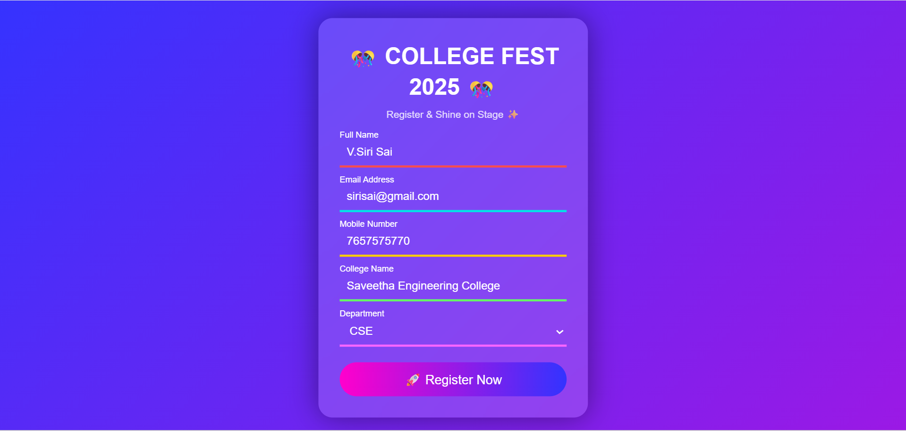

# Ex09 Event Registration Web Application
# Date:22-12-25
# AIM:
To design, develop and deploy a web application for event registration.

# DESIGN STEPS:
## Step 1:
Create a new frame.

## Step 2:
Select any one preset size of your choice.

## Step 3:
Select the shapes you need.

## Step 4:
Import images as needed.

## Step 5:
Create pages based on your need and link them.

## Step 6:
Validate the HTML and CSS code.

## Step 6:
Publish the website in the given URL.

# DESIGN TOOL:
figma

# CODE:
```
index.html
<!DOCTYPE html>
<html lang="en">
<head>
    <meta charset="UTF-8">
    <title>College Fest Registration</title>
    <link rel="stylesheet" href="style.css">
</head>
<body>

<div class="bg-animation"></div>

<div class="form-box">
    <h1>🎊 COLLEGE FEST 2025 🎊</h1>
    <p class="subtitle">Register & Shine on Stage ✨</p>

    <form>
        <div class="input-box name">
            <input type="text" required>
            <label>Full Name</label>
        </div>

        <div class="input-box email">
            <input type="email" required>
            <label>Email Address</label>
        </div>

        <div class="input-box phone">
            <input type="tel" required>
            <label>Mobile Number</label>
        </div>

        <div class="input-box college">
            <input type="text" required>
            <label>College Name</label>
        </div>

        <div class="input-box dept">
            <select required>
                <option value=""></option>
                <option>CSE</option>
                <option>ECE</option>
                <option>EEE</option>
                <option>MECH</option>
                <option>CIVIL</option>
            </select>
            <label>Department</label>
        </div>

        <button>🚀 Register Now</button>
    </form>
</div>

</body>
</html>
```


style.css
```
* {
    margin: 0;
    padding: 0;
    box-sizing: border-box;
    font-family: 'Poppins', sans-serif;
}

/* Animated Background */
body {
    height: 100vh;
    background: linear-gradient(-45deg, #ff00cc, #3333ff, #00ffcc, #ff6600);
    background-size: 400% 400%;
    animation: gradientBG 10s ease infinite;
    display: flex;
    justify-content: center;
    align-items: center;
}

@keyframes gradientBG {
    0% { background-position: 0% 50%; }
    50% { background-position: 100% 50%; }
    100% { background-position: 0% 50%; }
}

/* Glass Form */
.form-box {
    width: 380px;
    padding: 30px;
    border-radius: 20px;
    background: rgba(255, 255, 255, 0.15);
    backdrop-filter: blur(15px);
    box-shadow: 0 0 40px rgba(0,0,0,0.4);
    color: white;
}

h1 {
    text-align: center;
    margin-bottom: 10px;
}

.subtitle {
    text-align: center;
    margin-bottom: 25px;
    font-size: 14px;
    opacity: 0.8;
}

/* Input Box */
.input-box {
    position: relative;
    margin-bottom: 22px;
}

.input-box input,
.input-box select {
    width: 100%;
    padding: 10px;
    background: transparent;
    border: none;
    outline: none;
    color: white;
    font-size: 16px;
    border-bottom: 3px solid;
}

/* Unique Line Colors */
.name input { border-color: #ff4d4d; }
.email input { border-color: #00e6e6; }
.phone input { border-color: #ffcc00; }
.college input { border-color: #66ff66; }
.dept select { border-color: #ff66ff; }

/* Floating Label */
.input-box label {
    position: absolute;
    left: 0;
    top: 10px;
    pointer-events: none;
    transition: 0.3s;
    font-size: 14px;
}

.input-box input:focus ~ label,
.input-box input:valid ~ label,
.input-box select:focus ~ label,
.input-box select:valid ~ label {
    top: -12px;
    font-size: 12px;
    color: #fff;
}

/* Button */
button {
    width: 100%;
    padding: 12px;
    border: none;
    border-radius: 30px;
    background: linear-gradient(90deg, #ff00cc, #3333ff);
    color: white;
    font-size: 18px;
    cursor: pointer;
    transition: 0.3s;
}

button:hover {
    transform: scale(1.05);
    box-shadow: 0 0 15px #fff;
}

```


# OUTPUT:


# RESULT:
The program to design, develop and deploy a web application for event registration is completed successfully.
